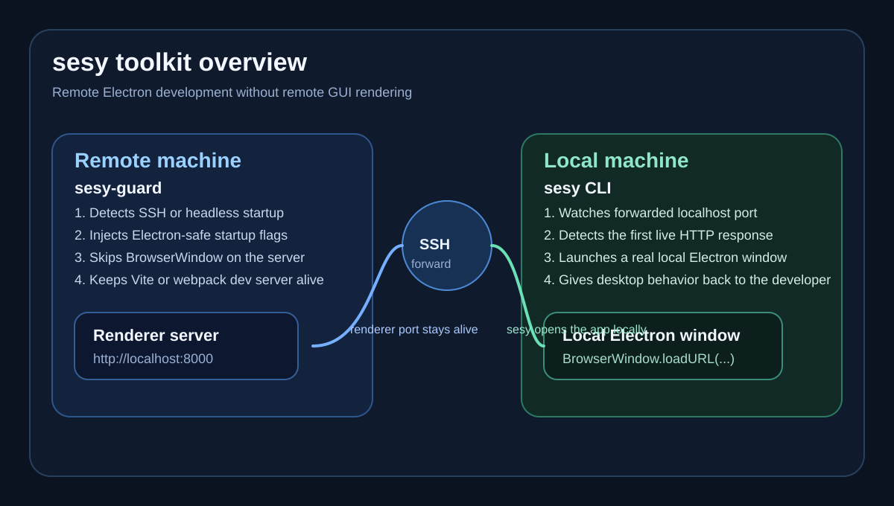
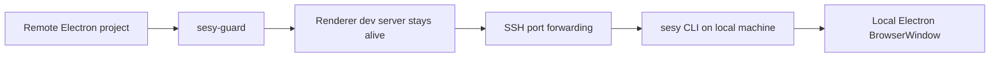
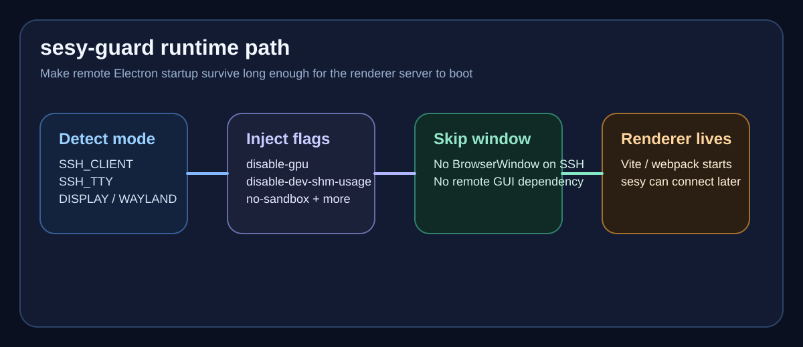
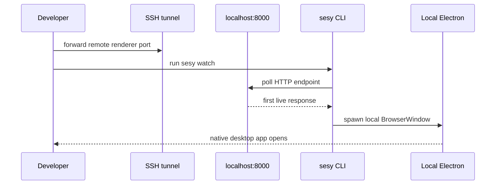

# sesy toolkit

[](https://nodejs.org/)
[](./LICENSE)
[](https://github.com/xgauravyaduvanshii/sesy)

Remote Electron development usually breaks in two places: the remote Electron main process crashes because there is no display server, and even when the renderer port exists, there is no native Electron window on your local machine. This repository contains both halves of that fix.

## What lives here

- `sesy-guard`: the package installed inside the remote Electron project to keep Electron alive in SSH and headless environments
- `sesy`: the CLI in [`cli/`](./cli) that watches the forwarded port on your local machine and opens a real Electron window locally

Repository: `https://github.com/xgauravyaduvanshii/sesy.git`  
Author: `xgauravyaduvanshii <xgauravyaduvanshii@gmail.com>`



## Repository map

```text
windowworker/
├── README.md                 # toolkit overview
├── package.json              # sesy-guard package
├── src/                      # sesy-guard runtime
├── docs/                     # sesy-guard docs
├── tests/                    # sesy-guard tests
├── cli/                      # full sesy CLI package
│   ├── package.json
│   ├── bin/
│   ├── src/
│   ├── docs/
│   └── tests/
└── .github/                  # repo automation and collaboration files
```

## Architecture



## Package 1: `sesy-guard`

`sesy-guard` is the remote-side safety layer. It prevents Electron from crashing when there is no X11, Wayland, or usable display stack.



### What it does

- detects SSH and headless environments
- injects Electron startup flags before `app.whenReady()`
- lets the renderer dev server continue booting
- helps teams skip `BrowserWindow` creation on the server

### Typical integration

```js
import { app } from 'electron';
import { initSesyGuard, isSshMode } from 'sesy-guard';

const mode = initSesyGuard();

app.whenReady().then(() => {
  if (!isSshMode()) {
    createWindow();
  }
});
```

### `sesy-guard` structure

```text
src/
├── index.js          # public API
├── index.cjs         # CommonJS export
├── index.d.ts        # TypeScript declarations
├── detector.js       # SSH/headless detection
├── injector.js       # Electron flag injection
├── errors.js         # custom error types
└── logger.js         # zero-dependency logger
```

### `sesy-guard` key docs

- [Getting started](./docs/getting-started.md)
- [How it works](./docs/how-it-works.md)
- [API reference](./docs/api-reference.md)
- [Integration guide](./docs/integration-guide.md)
- [Troubleshooting](./docs/troubleshooting.md)

## Package 2: `sesy` CLI

The CLI is the local-side experience. It watches the forwarded localhost port and restores the missing native window on your own machine.

### What it does

- loads per-project config from `.sesy.json`
- waits patiently for the forwarded dev server
- launches a real local Electron window when the port responds
- provides `init`, `watch`, `status`, and `doctor` commands

### CLI flow



### CLI project structure

```text
cli/
├── bin/sesy.js
├── src/
│   ├── commands/
│   ├── core/
│   ├── utils/
│   └── constants.js
├── docs/
├── tests/
└── README.md
```

### CLI key docs

- [CLI README](./cli/README.md)
- [Getting started](./cli/docs/getting-started.md)
- [How it works](./cli/docs/how-it-works.md)
- [Configuration](./cli/docs/configuration.md)
- [Troubleshooting](./cli/docs/troubleshooting.md)

## When to use which package

| Situation | Package |
|---|---|
| Remote Electron crashes immediately on SSH | `sesy-guard` |
| Renderer is alive but you need a local native window | `sesy` CLI |
| Full remote Electron development workflow | both together |

## End-to-end workflow

1. Install `sesy-guard` in the remote Electron project.
2. Add the guard initialization at the top of the Electron main process.
3. Start the remote dev server over SSH.
4. Forward the renderer port to your local machine.
5. Install and run the `sesy` CLI locally.
6. Let `sesy` open the Electron window on your own machine.

## Development and verification

### Root package

```bash
npm install
npm test
```

### CLI package

```bash
cd cli
npm install
npm test
```

## Collaboration

This repository also includes:

- [CONTRIBUTING.md](./CONTRIBUTING.md)
- [CODE_OF_CONDUCT.md](./CODE_OF_CONDUCT.md)
- [SECURITY.md](./SECURITY.md)
- [SUPPORT.md](./SUPPORT.md)

## Maintainer

- GitHub: [xgauravyaduvanshii](https://github.com/xgauravyaduvanshii)
- Email: [xgauravyaduvanshii@gmail.com](mailto:xgauravyaduvanshii@gmail.com)

## License

MIT
