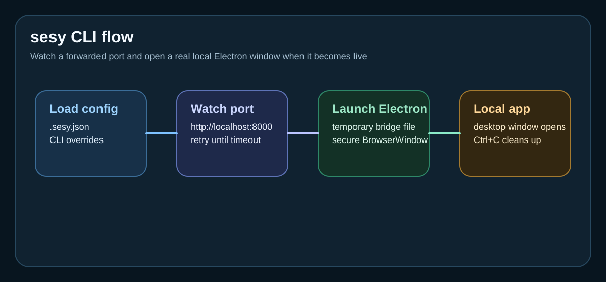
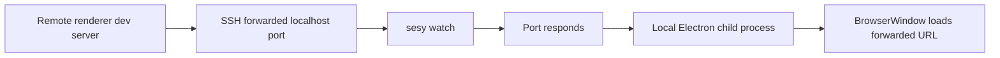
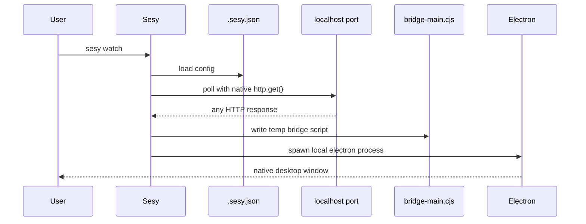
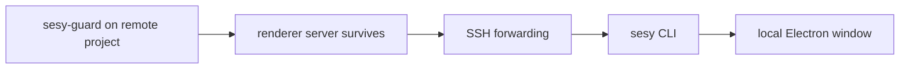

# sesy

[](https://www.npmjs.com/package/@xgauravyaduvanshii/sesy)
[](../LICENSE)
[](https://nodejs.org/)
[](https://github.com/xgauravyaduvanshii/sesy)

Run your remote SSH Electron project in a local window, instantly.

`sesy` is the local half of the workflow. It assumes your remote Electron project is already exposing a renderer server over SSH port forwarding, then restores the part the browser cannot: a native Electron desktop window on your machine.

Repository: `https://github.com/xgauravyaduvanshii/sesy.git`  
Author: `xgauravyaduvanshii <xgauravyaduvanshii@gmail.com>`



## Why sesy exists

Web apps are easy over SSH. Forward `localhost:3000`, open Chrome, and keep coding. Electron apps are different because the renderer is only half the experience. You still need a native Electron shell and `BrowserWindow`, and Chrome cannot stand in for that.

`sesy` closes that gap by turning a forwarded renderer URL back into a local Electron app session.

## Core workflow



## Quick start

### 1. Install

```bash
npm i @xgauravyaduvanshii/sesy
```

### 2. Initialize a project

```bash
sesy init
```

### 3. Start the remote Electron renderer

```bash
npm run dev
```

### 4. Make sure the port is forwarded

Typical example:

```bash
ssh -L 8000:localhost:8000 your-server
```

### 5. Open the local window

```bash
sesy watch
```

## Commands

| Command | Purpose | Typical use |
|---|---|---|
| `sesy init` | create `.sesy.json` | first setup in a project |
| `sesy watch` | wait for the renderer and launch Electron | everyday development |
| `sesy status` | inspect current config and environment | quick diagnostics |
| `sesy doctor` | run setup checks with fix hints | troubleshooting |

## Command flow



## Project structure

```text
cli/
├── bin/sesy.js
├── src/
│   ├── commands/
│   │   ├── init.js
│   │   ├── watch.js
│   │   ├── status.js
│   │   └── doctor.js
│   ├── core/
│   │   ├── config.js
│   │   ├── watcher.js
│   │   └── launcher.js
│   ├── utils/
│   │   ├── logger.js
│   │   ├── errors.js
│   │   ├── globalErrorHandler.js
│   │   └── firstRun.js
│   └── constants.js
├── docs/
├── tests/
└── README.md
```

## Configuration

`.sesy.json` controls how the local window is launched and how long the CLI waits.

| Field | Type | Default | Description |
|---|---|---|---|
| `port` | number | `8000` | forwarded renderer port |
| `framework` | string | `"electron"` | current framework selector |
| `windowWidth` | number | `1280` | local BrowserWindow width |
| `windowHeight` | number | `800` | local BrowserWindow height |
| `pollIntervalMs` | number | `500` | port polling interval |
| `pollTimeoutMs` | number | `60000` | give-up timeout |
| `electronArgs` | array | `[]` | extra Electron launch args |
| `env` | object | `{}` | extra Electron environment variables |

Example:

```json
{
  "port": 8000,
  "windowWidth": 1440,
  "windowHeight": 900,
  "pollIntervalMs": 500,
  "pollTimeoutMs": 60000,
  "electronArgs": [],
  "env": {}
}
```

## Where sesy fits with sesy-guard

`sesy` works best with `@xgauravyaduvanshii/sesy-guard`:

- `@xgauravyaduvanshii/sesy-guard` keeps the remote Electron main process alive in SSH
- `sesy` uses the resulting forwarded port to open the native app locally



## Documentation

- [Getting started](./docs/getting-started.md)
- [How it works](./docs/how-it-works.md)
- [Configuration](./docs/configuration.md)
- [Watch command](./docs/commands/watch.md)
- [Init command](./docs/commands/init.md)
- [Status command](./docs/commands/status.md)
- [Doctor command](./docs/commands/doctor.md)
- [Troubleshooting](./docs/troubleshooting.md)
- [Multiple projects](./docs/advanced/multiple-projects.md)
- [Custom Electron](./docs/advanced/custom-electron.md)

## Local development

```bash
npm install
npm test
node bin/sesy.js --help
```

## Troubleshooting

If the forwarded port never comes up, the window stays blank, or Electron cannot be found, start with [docs/troubleshooting.md](./docs/troubleshooting.md).

## License

MIT
